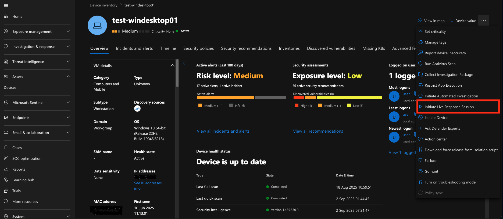
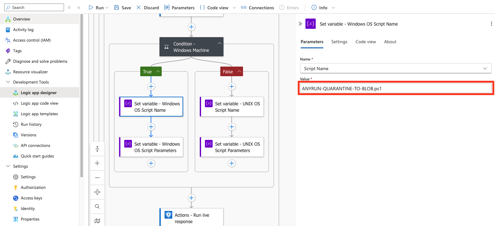

    

______________________________________________________________________

# Microsoft Sentinel Connector for automated File and URL analysis via ANY.RUN Interactive Malware Sandbox and Microsoft Defender for Endpoint

## Overview

This template makes the incident enrichment process in Microsoft Sentinel even more automated if you are also using Microsoft Defender for Endpoint (MDE). 
In this case, the entire automation mechanism can be combined into a single Azure Logic App, leveraging MDE's capabilities to extract files from UNIX- or Windows-endpoints using the bash and PowerShell script we offer.

This Logic App allows you to send both URLs and files contained in the incident entities for analysis in the ANY.RUN Sandbox. The playbook enables initiating Live Response sessions to hosts connected to Microsoft Defender for Endpoint. Within these Live Response sessions, a script is launched that extracts files from the endpoint and sends them for temporary storage to an Azure Blob Storage container. Once the file arrives in Blob Storage, the Logic App retrieves it and forwards it for analysis to the ANY.RUN API.

After the analysis is completed in the ANY.RUN Sandbox, its most significant results are transmitted to the incident: verdict, score, and tags, which help you obtain more detailed information about whether the object of interest is dangerous. Additionally, IoCs discovered during the analysis in the ANY.RUN Sandbox will be added to the Sentinel TI Portal.

## Requirements:
- ANY.RUN API-Key
- Microsoft Sentinel
- Azure Logic App (Flex Consumption plan)
- Azure Blob Storage
- Microsoft Defender for Endpoint

## Deployment

### Import Azure Logic App template

- Click below to deploy Azure Logic App with **Flex Consumption plan**

- Enter the parameters required for deploying the Logic App.

- Description of the required parameters:

| Parameter Name              | Description                                                                 |
|-----------------------------|-----------------------------------------------------------------------------|
| logicAppName                | Workflow name.                                                              |
| azureTenantId               | Azure Tenant ID for authentication in connections.                          |
| azureClientId               | Client ID for authentication (ID of the App Registration created before).   |
| azureClientSecret           | Client Secret for authentication.                                           |
| keyVaultName                | Key Vault name.                                                             |
| keyVaultUri                 | Key Vault URI (copy Vault URI from your Key Vault overview).                |
| azureBlobStorageAccountName | Azure Blob Storage Account Name.                                            |
| azureBlobStorageContainerName | Azure Blob Storage Container Name.                                        |

## Microsoft Defender for Endpoint configuration and additional script

> **Note:** To allow the connector to extract all files of interest from endpoints (including potentially dangerous ones), we recommend setting `Quarantine` as the default action for your MDE. **!ATTENTION!** Be careful when configuring antivirus policies, as this can be potentially dangerous. Study:
>
> - [Configure remediation for Microsoft Defender Antivirus detections](https://learn.microsoft.com/en-us/defender-endpoint/configure-remediation-microsoft-defender-antivirus)
>
> - [Settings for Microsoft Defender Antivirus policy in Microsoft Intune for Windows devices](https://learn.microsoft.com/en-us/intune/intune-service/protect/antivirus-microsoft-defender-settings-windows)

### Enable Live Response Sessions

- Open your [MDE portal](https://security.microsoft.com).

- Navigate to **System** > **Settings** > **Endpoints** > **General** > **Advanced features**.

- Enable the following settings: **Live Response**, **Live Response for Servers**, and **Live Response unsigned script execution**.

### Upload Helper Scripts to the Local Library of Your Endpoints

- Open your MDE portal.

- Navigate to **Assets** > **Devices**.

- Open the required device.

- Click on `...` in the upper right corner and **Initiate Live Response session**.

- Click **Upload file to library**.

- Click **Upload file to library** again, select the script from your file system (after downloading it from our [library](https://github.com/rollehfoh/ANY.RUN/tree/main/connectors/Microsoft/MS%20Sentinel%20SIEM-SOAR/ANYRUN-Sandbox-Defender/scripts)), or create your own script. After selecting, click **Submit**.

### Declaring Script Names in the Deployed Logic App (Optional)

The Logic App we propose dynamically selects the script extension (.sh or .ps1) depending on the endpoint's operating system. If you need to run a script with a different name from the local library, you can change it in the Logic App.

- Open the deployed **ANYRUN-Sandbox-Defender** Logic App.

- Navigate to **Development Tools** > **Logic app designer**.

- In the Logic app designer, expand the following action blocks: **For each - Host** > **For each - Find file path on the target host** > **Condition - Check if KQL Result is not empty (True)** > **Condition - Windows Machine**.

- In the expanded condition, select the actions **Set variable - Windows OS Script Name** and **Set variable - UNIX OS Script Name** and change the script name to the one you need (additionally, you may also need to change the script launch parameters in the actions **Set variable - Windows OS Script Parameters** and **Set variable - UNIX OS Script Parameters**).

