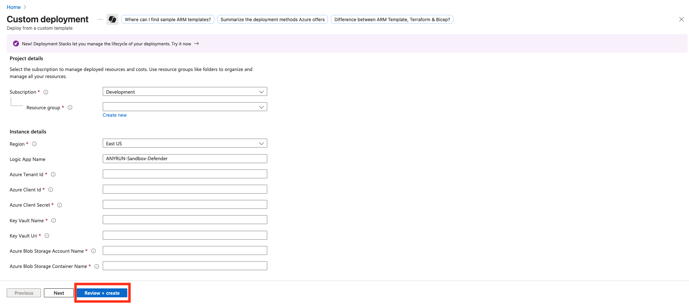

    

______________________________________________________________________

# Microsoft Sentinel Connector for automated File and URL analysis via ANY.RUN Interactive Malware Sandbox and Microsoft Defender for Endpoint

## Overview

This template makes the incident enrichment process in Microsoft Sentinel even more automated if you are also using Microsoft Defender for Endpoint (MDE). 
In this case, the entire automation mechanism can be combined into a single Azure Logic App, leveraging MDE's capabilities to extract files from UNIX- or Windows-endpoints using the bash and PowerShell script we offer.

This Logic App allows you to send both URLs and files contained in the incident entities for analysis in the ANY.RUN Sandbox. The playbook enables initiating Live Response sessions to hosts connected to Microsoft Defender for Endpoint. Within these Live Response sessions, a script is launched that extracts files from the endpoint and sends them for temporary storage to an Azure Blob Storage container. Once the file arrives in Blob Storage, the Logic App retrieves it and forwards it for analysis to the ANY.RUN API.

After the analysis is completed in the ANY.RUN Sandbox, its most significant results are transmitted to the incident: verdict, score, and tags, which help you obtain more detailed information about whether the object of interest is dangerous. Additionally, IoCs discovered during the analysis in the ANY.RUN Sandbox will be added to the Sentinel TI Portal.

## Requirements:
- ANY.RUN API-Key
- Microsoft Sentinel
- Azure Logic App (Flex Consumption plan)
- Azure Blob Storage
- Microsoft Defender for Endpoint

## Deployment

### Import Azure Logic App template

- Click below to deploy Azure Logic App with **Flex Consumption plan**

- Enter the parameters required for deploying the Logic App.

- Description of the required parameters:

| Parameter Name              | Description                                                                 |
|-----------------------------|-----------------------------------------------------------------------------|
| logicAppName                | Workflow name.                                                              |
| azureTenantId               | Azure Tenant ID for authentication in connections.                          |
| azureClientId               | Client ID for authentication (ID of the App Registration created before).   |
| azureClientSecret           | Client Secret for authentication.                                           |
| keyVaultName                | Key Vault name.                                                             |
| keyVaultUri                 | Key Vault URI (copy Vault URI from your Key Vault overview).                |
| azureBlobStorageAccountName | Azure Blob Storage Account Name.                                            |
| azureBlobStorageContainerName | Azure Blob Storage Container Name.                                        |
