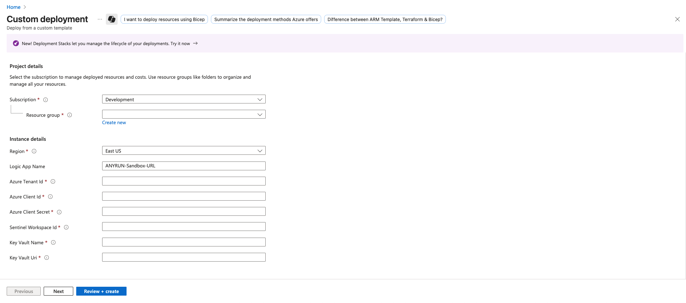

    

______________________________________________________________________

# Microsoft Sentinel Connector for automated URL analysis via ANY.RUN Interactive Malware Sandbox

## Overview

This playbook extracts URL from incidents and submit it for analysis in the ANY.RUN Sandbox to enrich the incident with a verdict using a single Azure Logic App.

## Prerequisites:
- ANY.RUN API-Key
- Microsoft Sentinel
- Azure Logic App (Flex Consumption plan) 

## Deployment

### Key Vault

- You need the Hunter pricing plan in ANY.RUN and your API key. We recommend storing your API key in Azure Key Vault. To do this, select your existing Key Vault or create a new one. Then, navigate to the **Objects** > **Secrets** section and create a new secret named `ANYRUN-APIKey` (IMPORTANT! It is recommended to keep this name unchanged, as otherwise, you will need to update it later in the deployed Logic App).

### App Registration and API Permissions

- If you haven't done this before, you need to create a new application for your connector. To do this, go to **Microsoft Entra ID**.

  - Click **Add** > **App registration**

  - Name your new application and click **Register**

- For the created application, add the following permissions for API connections in the **Manage** > **API permissions** > **Add a permission** tab:

  - In the **Microsoft APIs** tab, add **Azure Key Vault**.

  - Add the following permissions for it:

| Category | Permission Name   | Description                                                                 |
|----------|-------------------|-----------------------------------------------------------------------------|
| N/A      | user_impersonation | Allow the application full access to the Azure Key Vault service on behalf of the signed-in user |

- Next, add an API connection for **WindowsDefenderATP**. Select the corresponding API in the **APIs my organization uses** tab.

- Then, select **Application permissions**.

- Select the following permissions:

| Category | Permission Name    | Description                                                                 |
|----------|--------------------|-----------------------------------------------------------------------------|
| Alert    | Alert.Read.All     | Needed to retrieve alerts and related evidence                              |
| Alert    | Alert.ReadWrite.All| Needed to enrich alerts with sample information                             |
| Machine  | Machine.LiveResponse | Needed to gather evidences from machines                                  |
| Machine  | Machine.Read.All   | Needed to retrieve information about machines                               |
| Ti       | Ti.Read.All        | Needed to retrieve indicators                                               |
| Ti       | Ti.ReadWrite       | Needed to retrieve and submit indicators (application specific)             |
| Ti       | Ti.ReadWrite.All   | Needed to retrieve and submit indicators (general)                          |
| Library  | Library.Manage     | Needed to upload custom ps1 script for retrieving AV related evidences     |
