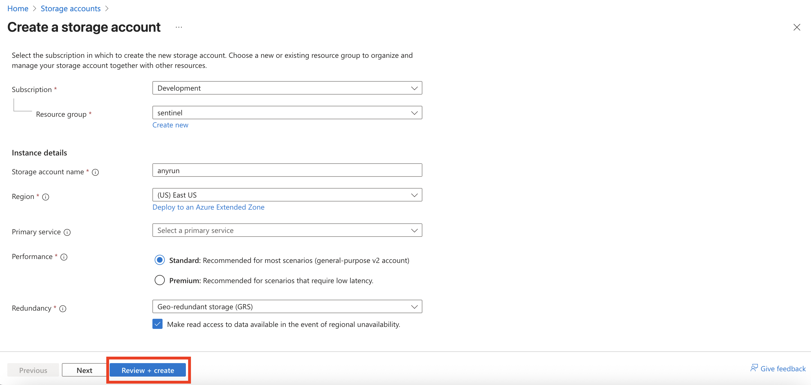

    

______________________________________________________________________

# Microsoft Defender for Endpoint Connector for ANY.RUN Malware Sandbox

## Overview

This connector integrates Microsoft Defender for Endpoint (MDE) with the ANY.RUN Sandbox to enrich MDE alerts through automated malware analysis. It triggers automatically upon the registration of a new alert in MDE, extracting and analyzing entities such as URLs or files associated with the alert.

The enrichment process adds valuable context directly to the alert: comments include the ANY.RUN verdict, threat score, a link to the detailed analysis report, and any Indicators of Compromise (IoCs) discovered during the sandbox detonation. Extracted IoCs are also imported into MDE's local Threat Intelligence lists for enhanced detection and response.

This integration empowers SOC teams with deeper insights into potential threats, accelerating triage, reducing false positives, and enabling proactive hunting — all while leveraging ANY.RUN's interactive sandbox capabilities for real-time behavioral analysis.

## Requirements
- Microsoft Defender for Endpoint
- ANY.RUN API Key
- Microsoft Azure resources:
  - Logic App with Flex Consumption plan
  - Function App Flex Consumption plan
  - Blob Storage

## Solution Overview

## Prerequisites

### App Registration

- You need to create a new application for your connector. To do this, go to **Microsoft Entra ID**.

- Click **Add** > **App registration**.

- Name your new application and click **Register**.

### Secret Value of created App

- To generate the Client Secret, go to your application's page and click **Generate Secret** in the **Certificates & secrets** tab.

- Specify the key name and its expiration date (optional).

- Copy and **save the Secret Value**. This value is required for deploying the connector later.

### Microsoft Defender ATP API Permissions for new App

- For the created application, add the following permissions for API connections in the **Manage** > **API permissions** > **Add a permission** tab:

- Add an API connection for **WindowsDefenderATP**. Select the corresponding API in the **APIs my organization uses** tab.

- Then, select **Application permissions**.

- Select the following permissions:

|       Category       |   Permission Name   | Description                                                            |
|----------------------|---------------------|------------------------------------------------------------------------|
| Alert                | Alert.Read.All      | Needed to retrieve alerts and related evidence                         |
| Alert                | Alert.ReadWrite.All | Needed to enrich alerts with sample information                        |
| Machine              | Machine.LiveResponse | Needed to gather evidences from machines                               |
| Machine              | Machine.Read.All    | Needed to retrieve information about machines                          |
| Ti                   | Ti.Read.All         | Needed to retrieve indicators                                          |
| Ti                   | Ti.ReadWrite        | Needed to retrieve and submit indicators (application specific)        |
| Ti                   | Ti.ReadWrite.All    | Needed to retrieve and submit indicators (general)                     |
| Library              | Library.Manage      | Needed to upload custom ps1 script for retrieving AV related evidences |

### Storage Account

- Go to Azure Storage Accounts.

- Click **Create**.

- Type the name of Storage Account and click **Review + Create**.

- Open your Storage Account. Go to **Data Storage** > **Containers**.

- Click **Add container**, type the **Name** for it and **Create**.

- Go to **Security + networking** > **Access keys**, copy and save **Key** and **Connection string**. This values are required for deploying the connector later.

 
## Deployment

### Deploy Azure Function App

- Click below to deploy Azure Function App with **Flex Consumption plan**
 

### Deploy Azure Logic App

- Click below to deploy Azure Logic App with **Flex Consumption plan**
 

- Enter the parameters required for deploying the Logic App and click **Review + create**.

- Description of the required parameters:

| Parameter Name                  | Description                                                                 |
|---------------------------------|-----------------------------------------------------------------------------|
| logicAppName                    | Workflow name.                                                              |
| azureTenantId                   | Tenant ID for authentication in connections.                                |
| azureClientId                   | Client ID for authentication (ID of the App Registration created before).   |
| azureClientSecret               | Client Secret for authentication.                                           |
| functionAppName                 | Name of the Function App deplyed before.                                    |

## Microsoft Defender for Endpoint Configuration

> **Note:** To allow the connector to extract all files of interest from endpoints (including potentially dangerous ones), we recommend setting `Quarantine` as the default action for your MDE. **!ATTENTION!** Be careful when configuring antivirus policies, as this can be potentially dangerous. See:
>
> - [Configure remediation for Microsoft Defender Antivirus detections](https://learn.microsoft.com/en-us/defender-endpoint/configure-remediation-microsoft-defender-antivirus)
>
> - [Settings for Microsoft Defender Antivirus policy in Microsoft Intune for Windows devices](https://learn.microsoft.com/en-us/intune/intune-service/protect/antivirus-microsoft-defender-settings-windows)

### Enable Live Response Sessions

- Open your [MDE portal](https://security.microsoft.com).

- Navigate to **System** > **Settings** > **Endpoints** > **General** > **Advanced features**.

- Enable the following settings: **Live Response**, **Live Response for Servers**, and **Live Response unsigned script execution**.

## Logic App Configuration (Optional)

### Customization of Analysis Parameters in ANY.RUN Sandbox

- The parameters for launching URL or file analysis in the ANY.RUN Sandbox are defined in the deployed Logic App.

- Open your Logic App `ANYRUN-Sandbox-MDE-LA` and navigate to **Development Tools** > **Logic app Designer**.

- The following three actions are responsible for declaring the parameters:

  - `ANY.RUN general analysis options`

  - `ANY.RUN Windows analysis options`

  - `ANY.RUN Linux analysis options`

- In the `ANY.RUN general analysis options` action, you can modify parameters that define general, OS-independent options such as analysis duration, virtual machine network settings, privacy, and more. For example, if you need to **increase the initial analysis time** for a more detailed examination of the object, select the **opt_timeout** variable and set the desired value in seconds, for example `360`.

- In the `ANY.RUN Windows analysis options` and `ANY.RUN Linux analysis options` actions, you can modify parameters that affect OS-specific virtual machine settings, such as the OS version and configuration, initial object location and launch parameters, and more. For example, if you need to run the analysis on a virtual machine with Windows 11 instead of Windows 10, click on the `ANY.RUN Windows analysis options` action, select the **windows_env_version** variable, and set the value to `11`.

> **Note:** To see the full list of available parameters and their values, visit our **[API documentation](https://any.run/api-documentation/)**.

### Filtering Alerts and Objects for Analysis

Since the trigger in the Logic App for initiating the connector's work is the appearance of a new alert in Microsoft Defender, it is recommended to declare conditions by which the Logic App will filter alerts for subsequent enrichment in the ANY.RUN Sandbox. By default, the condition is specific modules of Microsoft Defender from which the alert came - `WindowsDefenderAtp` and `WindowsDefenderAv`. That is, the connector will process all alerts that come only from these two modules.

- If you need to add one or more additional conditions by which alerts will be filtered, open your Logic App `ANYRUN-Sandbox-MDE-LA` and navigate to **Development Tools** > **Logic app Designer**.

- Find the action `Check if the alert is from EDR or Antivirus` and after the `True` condition, click `+` and select `Add an action` to add a new action.

- In the window that appears on the right, in the search bar, find and select `Condition`.

- Then, after the action is added, you need to configure it - change its name (optional) and set the condition itself.

- To filter alerts by their attributes, you can check the `Outputs` of the `Alerts - Get single alert` action.

- After you have added the condition, after `False` add a `Terminate` action that will interrupt the further workflow for this alert.

- Drag the actions following the added condition (by default this is `Is machine has Windows OS`) to the `True` section.

- Save the changes.

#### Examples of Alert Filtering Conditions

1. Alert Criticality

   - You can enrich with the ANY.RUN Sandbox only alerts with the criticality you need, for example **Medium** or **High**.

   - In the created condition, in the Choose a value field, type `/` and select **Insert dynamic content**.

   - As the parameter to check, select `Alert Alert Severity` from the `Alerts - Get single alert` action.

   - Replace the logical operator `AND` with `OR`, click `+ New item` and select `Add row`.

   - In the new row, also add `Alert Alert Severity`.

   - Set the values `High` and `Medium` for the added parameters.

   - Save the changes.

2. Alert Category

   - You can enrich with the ANY.RUN Sandbox only alerts of the category you need, for example **Malware**.

   - In the created condition, in the Choose a value field, type `/` and select **Insert dynamic content**.

   - As the parameter to check, select `Alert Category` from the `Alerts - Get single alert` action.

   - Set the value `Malware` for the added parameter.

   - Save the changes.

3. Machine Properties

   - You can filter alerts depending on the Machine from which it came. For example, you can filter by **Machine tags** or by **RBAC groups** in which the Machine is included.

   - As the parameter to check, select `Machine Machine tags` or `Machine RBAC group name` or any other suitable parameter from the `Machines - Get single machine` action.

   - Set the value corresponding to your devices for the added parameter.

   - Save the changes.
