

    

______________________________________________________________________

# Microsoft Defender for Endpoint Connector for ANY.RUN Threat Inteligence Feeds

## Overview

ANY.RUN’s [Threat Intelligence Feeds](https://any.run/threat-intelligence-feeds/?utm_source=anyrungithub&utm_medium=documentation&utm_campaign=opencti_feeds&utm_content=linktofeedslanding) (TI Feeds) is a continuously updated source of fresh network-based Indicators of Compromise (IOCs): IPs, domains, and URLs. 

The IOCs are extracted from real-time analyses done by experts from 15,000 companies in ANY.RUN’s Interactive Sandbox. 

### Connector’s functionality 

The connector for Threat Intelligence Feeds provides Microsoft Defenderfor Endpoint (MDE) users with simple, automated access to uniquely sourced and accurate indicators of compromise. 

- Get access to pre-processed IOCs with minimum false positives
- Detect threats early and prevent attacks using high-quality indicators 

### Key SOC benefits 

Integrate TI Feeds with MDE for an easy access to all the benefits it brings:  

- Expanded Coverage: ANY.RUN’s exclusive IOCs come from Memory Dumps, Suricata IDS, in-browser data, and internal threat categorization systems, increasing the chance of detection of the most evasive threats.
- Reduced Workload: The indicators are pre-processed to avoid false positives and ready to be used for malware analysis or incident investigation.

## Requirements
- Microsoft Defender for Endpoint
- [ANY.RUN TI Feeds subscription](https://intelligence.any.run/plans) and Basic Authentication token (To obtain it, please contact your ANY.RUN account manager directly or [fill out the request form](https://app.any.run/contact-us))
- Microsoft Azure resources:
  - Logic App with Flex Consumption plan
  - Function App Flex Consumption plan

## Prerequisites

### App Registration

- You need to create a new application for your connector. To do this, go to **Microsoft Entra ID**.

- Click **Add** > **App registration**.

- Name your new application and click **Register**.

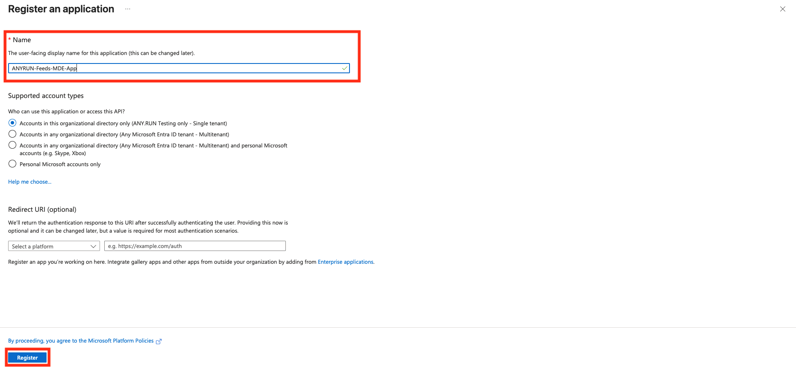

### Secret Value of created App

- To generate the Client Secret, go to your application's page and click **Generate Secret** in the **Certificates & secrets** tab.

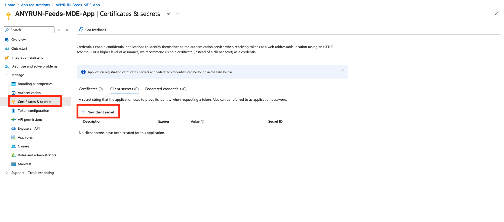

- Specify the key name and its expiration date (optional).

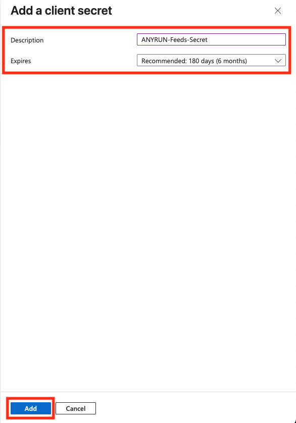

- Copy and **save the Secret Value**. This value is required for deploying the connector later.

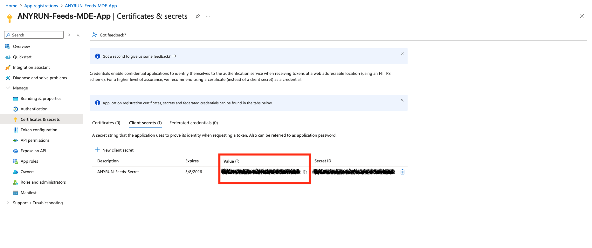

### Microsoft Defender ATP API Permissions for new App

- For the created application, add the following permissions for API connections in the **Manage** > **API permissions** > **Add a permission** tab:

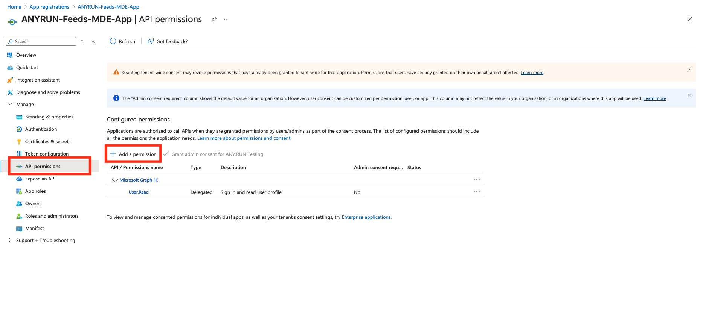

- Add an API connection for **WindowsDefenderATP**. Select the corresponding API in the **APIs my organization uses** tab.

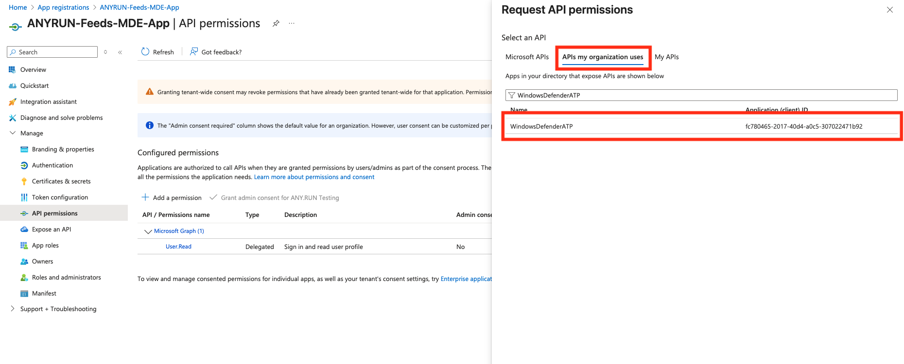

- Then, select **Application permissions**.

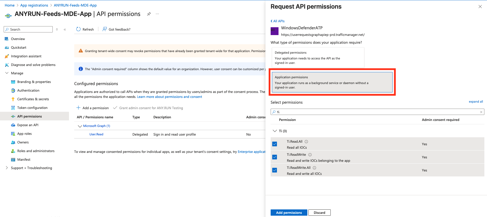

- Select the following permissions:

|       Category       |   Permission Name   | Description                                                            |
|----------------------|---------------------|------------------------------------------------------------------------|
| Ti                   | Ti.Read.All         | Needed to retrieve indicators                                          |
| Ti                   | Ti.ReadWrite        | Needed to retrieve and submit indicators (application specific)        |
| Ti                   | Ti.ReadWrite.All    | Needed to retrieve and submit indicators (general)                     |

## Deployment

### Deploy Azure Function App

- Click below to deploy Azure Function App with **Flex Consumption plan**
 

- Enter the parameters required for deploying the Logic App and click **Review + create**.

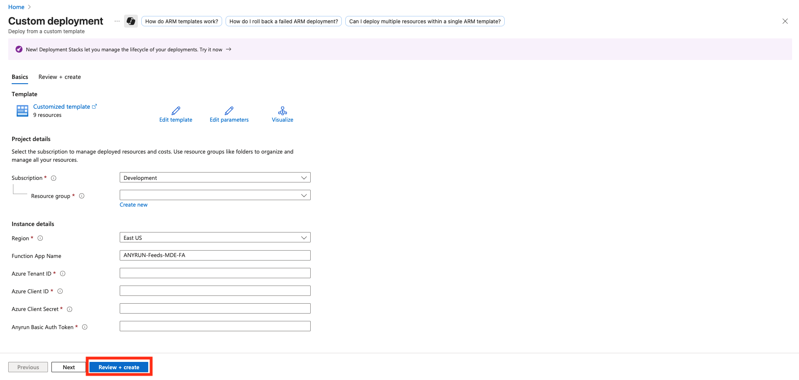

- Description of the required parameters:

| Parameter Name                  | Description                                                                 |
|---------------------------------|-----------------------------------------------------------------------------|
| functionAppName                 | Function name.                                                              |
| azureTenantId                   | Tenant ID for authentication in connections.                                |
| azureClientId                   | Client ID for authentication (ID of the App Registration created before).   |
| azureClientSecret               | Client Secret for authentication.                                           |
| anyrunBasicAuthToken            | Your ANY.RUN token to access TI Feeds data.                                 |

### Deploy Azure Logic App

- Click below to deploy Azure Logic App with **Flex Consumption plan**
 

- Enter the parameters required for deploying the Logic App and click **Review + create**.

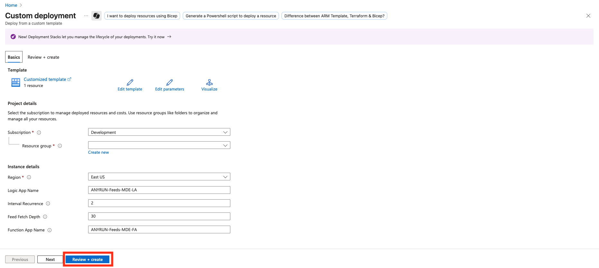

- Description of the required parameters:

| Parameter Name                  | Description                                                                 |
|---------------------------------|-----------------------------------------------------------------------------|
| logicAppName                    | Workflow name.                                                              |
| intervalRecurrence              | Interval of recurrence for the logic app (in hours).                        |
| feedFetchDepth                  | Depth of the feed to fetch (in days).                                       |
| functionAppName                 | Name of the Function App deplyed before.                                    |

## Logic App Configuration (Optional)

### Recurrence Interval

You can change the recurrence interval at which the Logic App will run and update the TI Feeds data.

- Open your Logic App ANYRUN-Feeds-MDE-LA, navigate to **Development tools** > **Logic app designer**.

- Select the `Recurrence` action and specify the required value in the `Interval` field.

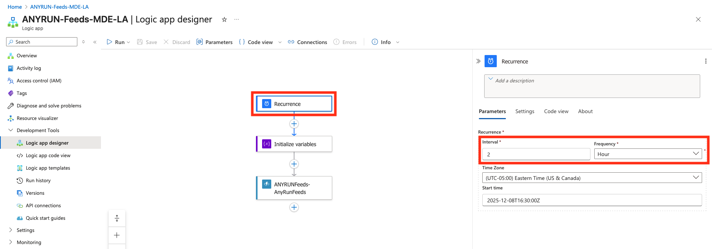

### Indicator Fetch Depth

You can change the fetch depth of indicators in ANY.RUN TI Feeds. This parameter determines the period for which to extract data from ANY.RUN TI Feeds.

- Open your Logic App ANYRUN-Feeds-MDE-LA, navigate to **Development tools** > **Logic app designer**.

- Select the `Initialize variables` action and specify the required value in days in the `feed_fetch_depth` variable.

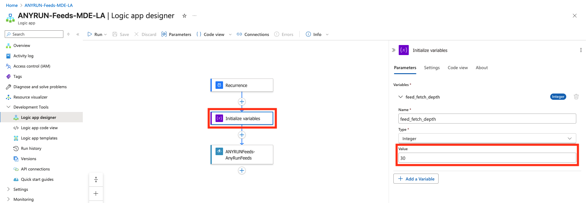
