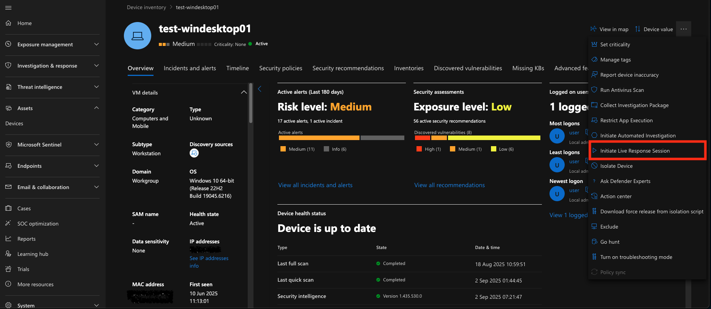
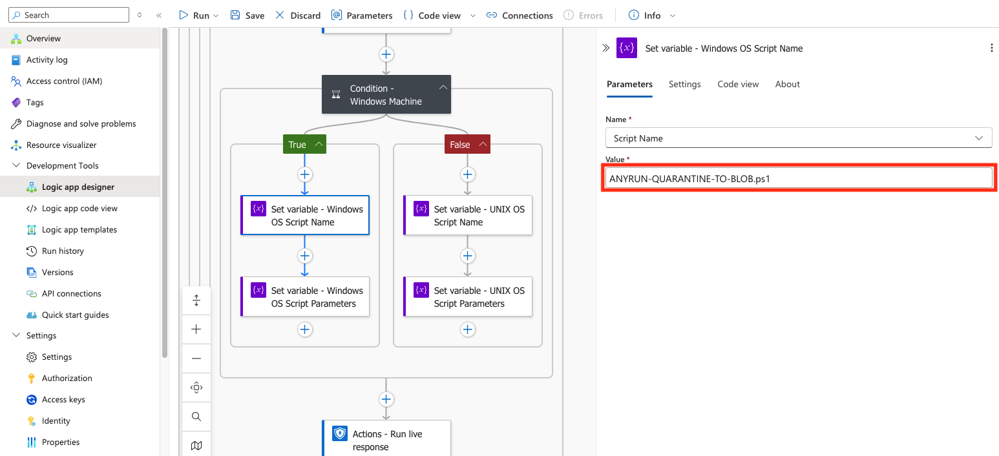

    

______________________________________________________________________

# Microsoft Sentinel Connector for automated File and URL analysis via ANY.RUN Malware Sandbox and Microsoft Defender for Endpoint

## Overview

This template makes the incident enrichment process in Microsoft Sentinel even more automated if you are also using Microsoft Defender for Endpoint (MDE). 
In this case, the entire automation mechanism can be combined into a single Azure Logic App, leveraging MDE's capabilities to extract files from UNIX- or Windows-endpoints using the bash and PowerShell script we offer.

This Logic App allows you to send both URLs and files contained in the incident entities for analysis in the ANY.RUN Sandbox. The playbook enables initiating Live Response sessions to hosts connected to Microsoft Defender for Endpoint. Within these Live Response sessions, a script is launched that extracts files from the endpoint and sends them for temporary storage to an Azure Blob Storage container. Once the file arrives in Blob Storage, the Logic App retrieves it and forwards it for analysis to the ANY.RUN API.

After the analysis is completed in the ANY.RUN Sandbox, its most significant results are transmitted to the incident: verdict, score, and tags, which help you obtain more detailed information about whether the object of interest is dangerous. Additionally, IoCs discovered during the analysis in the ANY.RUN Sandbox will be added to the Sentinel TI Portal.

## Requirements:
- ANY.RUN API-Key
- Microsoft Sentinel
- Azure Logic App (Flex Consumption plan)
- Azure Blob Storage
- Microsoft Defender for Endpoint

## Deployment

### Import Azure Logic App template

- Click below to deploy Azure Logic App with **Flex Consumption plan**

- Enter the parameters required for deploying the Logic App.

- Description of the required parameters:

| Parameter Name                   | Description                                                                 |
|----------------------------------|-----------------------------------------------------------------------------|
| logicAppName                     | Workflow Name.                                                              |
| azureTenantId                    | Azure Tenant ID for authentication.                                         |
| azureClientId                    | Azure Client ID for authentication.                                         |
| azureClientSecret                | Azure Client Secret for authentication.                                     |
| keyVaultName                     | Key Vault name.                                                             |
| keyVaultUri                      | Key Vault URI.                                                              |
| azureBlobStorageAccountName      | Azure Blob Storage Account Name.                                            |
| azureBlobStorageConnectionString | Azure Blob Storage Connection String.                                       |
| azureBlobStorageContainerName    | Azure Blob Storage Container Name.                                          |
| logAnalyticsWorkspaceName        | Log Analytics Workspace Name.                                               |
| functionAppName                  | Name of the Function App to call (deployed before).                         |

## Microsoft Defender for Endpoint configuration and additional script

> **Note:** To allow the connector to extract all files of interest from endpoints (including potentially dangerous ones), we recommend setting `Quarantine` as the default action for your MDE. **!ATTENTION!** Be careful when configuring antivirus policies, as this can be potentially dangerous. See:
>
> - [Configure remediation for Microsoft Defender Antivirus detections](https://learn.microsoft.com/en-us/defender-endpoint/configure-remediation-microsoft-defender-antivirus)
>
> - [Settings for Microsoft Defender Antivirus policy in Microsoft Intune for Windows devices](https://learn.microsoft.com/en-us/intune/intune-service/protect/antivirus-microsoft-defender-settings-windows)

### Enable Live Response Sessions

- Open your [MDE portal](https://security.microsoft.com).

- Navigate to **System** > **Settings** > **Endpoints** > **General** > **Advanced features**.

- Enable the following settings: **Live Response**, **Live Response for Servers**, and **Live Response unsigned script execution**.

### Upload Helper Scripts to the Local Library of Your Endpoints

- Open your MDE portal.

- Navigate to **Assets** > **Devices**.

- Open the required device.

- Click on `...` in the upper right corner and **Initiate Live Response session**.

- Click **Upload file to library**.

- Click **Upload file to library** again, select the script from your file system (after downloading it from our [library](https://github.com/rollehfoh/ANY.RUN/tree/main/connectors/Microsoft/Microsoft%20Sentinel/ANYRUN-Sandbox-Defender/scripts)), or create your own script. After selecting, click **Submit**.

### Declaring Script Names in the Deployed Logic App (Optional)

The Logic App we propose dynamically selects the script extension (.sh or .ps1) depending on the endpoint's operating system. If you need to run a script with a different name from the local library, you can change it in the Logic App.

- Open the deployed **ANYRUN-Sandbox-Defender** Logic App.

- Navigate to **Development Tools** > **Logic app designer**.

- In the Logic app designer, expand the following action blocks: **For each - Host** > **For each - Find file path on the target host** > **Condition - Check if KQL Result is not empty (True)** > **Condition - Windows Machine**.

- In the expanded condition, select the actions **Set variable - Windows OS Script Name** and **Set variable - UNIX OS Script Name** and change the script name to the one you need (additionally, you may also need to change the script launch parameters in the actions **Set variable - Windows OS Script Parameters** and **Set variable - UNIX OS Script Parameters**).

## Logic App configuration (Optional)

### ANY.RUN Sandbox analysis parameters

ANY.RUN is an interactive online malware analysis service for dynamic and static research of most types of threats using any environments. We offer a connector for Microsoft Sentinel, which you can independently adapt to your infrastructure and needs in just a few clicks. You can easily change the parameters used for analyzing the required File.

> **Note:** You can learn more about the capabilities of ANY.RUN Sandbox by reviewing our **[API documentation](https://any.run/api-documentation/)**.

The main setup and customization of the Logic App is available through the graphical editor (**Development tools** > **Logic app designer**) or the code editor (**Development tools** > **Logic app code view**).

- The analysis parameters in ANY.RUN Sandbox are defined in the actions of the deployed Logic App:
  - **HTTP-RunNewURLAnalysis**
  - **HTTP - Submit File to ANY.RUN Sandbox Windows**
  - **HTTP - Submit File to ANY.RUN Sandbox Ubuntu**
  - **HTTP - Submit File to ANY.RUN Sandbox Debian**

- For URL analysis - `HTTP-RunNewURLAnalysis`

- For File analysis - in the following three actions which are responsible for declaring the parameters:

  - `ANY.RUN general analysis options`

  - `ANY.RUN Windows analysis options`

  - `ANY.RUN Linux analysis options`

- In the `ANY.RUN general analysis options` action, you can modify parameters that define general, OS-independent options such as analysis duration, virtual machine network settings, privacy, and more. For example, if you need to **increase the initial analysis time** for a more detailed examination of the object, select the **opt_timeout** variable and set the desired value in seconds, for example `360`.

- In the `ANY.RUN Windows analysis options` and `ANY.RUN Linux analysis options` actions, you can modify parameters that affect OS-specific virtual machine settings, such as the OS version and configuration, initial object location and launch parameters, and more. For example, if you need to run the analysis on a virtual machine with Windows 11 instead of Windows 10, click on the `ANY.RUN Windows analysis options` action, select the **windows_env_version** variable, and set the value to `11`.

- Description of the main parameters:

| Parameter Name              | Description                                                                 |
|-----------------------------|-----------------------------------------------------------------------------|
| opt_timeout                 | Defines the timeout option for the analysis.                                |
| env_os                      | Specifies the operating system.                                             |
| env_bitness                 | Defines the bitness of the operating system.                                |
| env_version                 | Sets the version of the operating system.                                   |
| env_type                    | Specify the environment preset type.                                        |
| opt_automated_interactivity | Controls the automated interactivity (ML) option (changing this is not recommended). |
| auto_confirm_uac            | Enables automatic confirmation of Windows UAC requests (changing this is not recommended). |
| run_as_root                 | Allow the file to run with superuser privileges on Linux.                   |
| obj_ext_extension           | Specify whether to change the file extension to a valid one.                |

### Simultaneous Analysis of Objects in ANY.RUN Sandbox

ANY.RUN Sandbox allows users to perform multiple analyses simultaneously (availability and capability depend on your pricing plan). By default, if a Microsoft Sentinel incident contains multiple URLs or Files, each analysis will run sequentially (a new File analysis won't start until the previous one finishes, to avoid errors).

- To increase the speed of incident enrichment, you can analyze objects simultaneously. To do this, open the **For each - URLs** and **For each - detonate files to ANY.RUN Sandbox** loop > **Settings** and increase the **Degree of parallelism** value. It is recommended to set a value that does not exceed the number of possible parallel analyses in ANY.RUN Sandbox for your pricing plan.

> **Note**: To upgrade your pricing plan capabilities, [contact us](https://app.any.run/contact-us).
