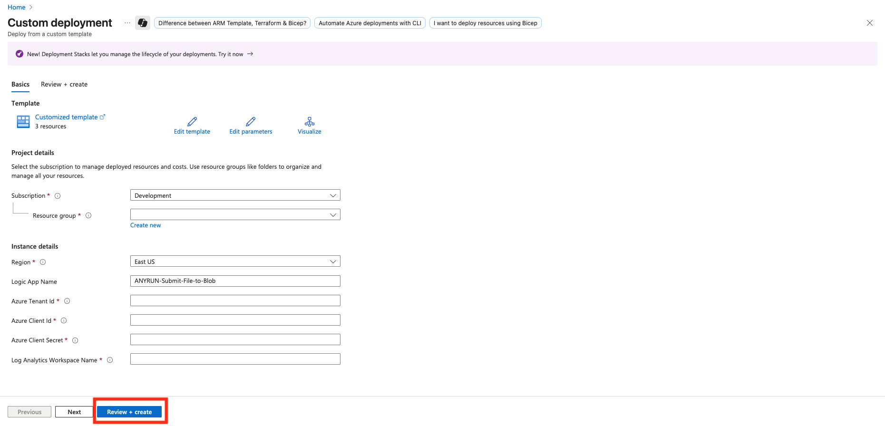
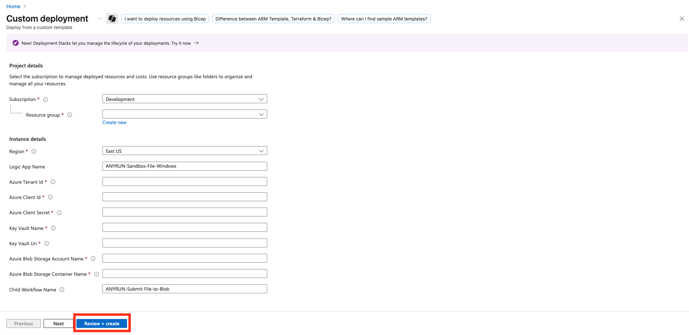

    

______________________________________________________________________

# Microsoft Sentinel Connector for automated File analysis via ANY.RUN Interactive Malware Sandbox

## Overview

This playbook allows you to send files from incidents for analysis in the ANY.RUN Sandbox. 
It uploads the file from the endpoint to Azure Blob Storage and then forwards it to the ANY.RUN Sandbox using an Azure Logic App.

Templates are provided for endpoints running the following operating systems:
- Windows
- UNIX (Ubuntu, Debian)

## Requirements:
- ANY.RUN API-Key
- Microsoft Sentinel
- Azure Logic App (Flex Consumption plan)
- Azure Blob Storage
- Microsoft Defender for Endpoint (**Optional**)

## Solution overview

The connector consists of two Azure Logic Apps: 
- Parent workflow (varies depending on the host operating system):
  - [ANYRUN-Sandbox-File-Windows](https://github.com/rollehfoh/ANY.RUN/blob/main/connectors/Microsoft/Microsoft%20Sentinel/ANYRUN-Sandbox-File/Logic%20Apps/ANYRUN-Sandbox-File-Windows.json)
  - [ANYRUN-Sandbox-File-Ubuntu](https://github.com/rollehfoh/ANY.RUN/blob/main/connectors/Microsoft/Microsoft%20Sentinel/ANYRUN-Sandbox-File/Logic%20Apps/ANYRUN-Sandbox-File-Ubuntu.json)
  - [ANYRUN-Sandbox-File-Debian](https://github.com/rollehfoh/ANY.RUN/blob/main/connectors/Microsoft/Microsoft%20Sentinel/ANYRUN-Sandbox-File/Logic%20Apps/ANYRUN-Sandbox-File-Debian.json)
- Child workflow (uniform for all operating systems):
  - [ANYRUN-Submit-File-to-Blob](https://github.com/rollehfoh/ANY.RUN/blob/main/connectors/Microsoft/Microsoft%20Sentinel/ANYRUN-Sandbox-File/Logic%20Apps/ANYRUN-Submit-File-to-Blob.json)

## Logic Apps description

### Parent Workflow
This Logic App serves as the main orchestration workflow for the connector. It is triggered by a Microsoft Sentinel incident webhook and processes file entities associated with the incident. The workflow submits files for analysis in ANY.RUN Sandbox obtained from Azure Blob Storage. 

### Child Workflow

This Logic App is a child workflow invoked by the parent to handle file upload from hosts to Azure Blob Storage using Microsoft Defender for Endpoint. It is triggered by an HTTP request from the parent and parses input data. For each file, it initiates MDE live response to execute a script on the host for upload file to Azure Blob Storage.

 > **Note:** The child playbook in this connector is designed to extract files from the endpoint and upload them to Azure Blob Storage using Microsoft Defender for Endpoint (MDE). If you use a different solution instead of MDE, you can replace this playbook with one adapted for your infrastructure.

## Deployment

### Import Azure Logic App template

#### Child Logic App

First, you need to deploy the child Logic App, as its parameters are required for configuring the parent one.

- Click below to deploy Child Azure Logic App with **Flex Consumption plan**
 

- Enter the parameters required for deploying the Logic App and click **Review + create**.

- Description of the required parameters:

| Parameter Name                  | Description                                                                 |
|---------------------------------|-----------------------------------------------------------------------------|
| LogicAppName                    | Workflow name.                                                              |
| AzureTenantId                   | Tenant ID for authentication in connections.                                |
| AzureClientId                   | Client ID for authentication (ID of the App Registration created before).   |
| azureClientSecret               | Client Secret for authentication.                                           |

#### Parent Logic App 

> **Note:** You can deploy all the proposed parent Logic Apps or select specific ones depending on the operating system installed on your endpoints. The parent Logic Apps operate independently of each other.

- Click below to deploy Parent Azure Logic App with **Flex Consumption plan**
  - ANYRUN-Sandbox-File-Windows

  - ANYRUN-Sandbox-File-Ubuntu

  - ANYRUN-Sandbox-File-Debian

- Enter the parameters required for deploying the Logic App and click **Review + create**.

- Description of the required parameters:

| Parameter Name              | Description                                                                 |
|-----------------------------|-----------------------------------------------------------------------------|
| logicAppName                | Workflow name.                                                              |
| azureTenantId               | Azure Tenant ID for authentication in connections.                          |
| azureClientId               | Client ID for authentication (ID of the App Registration created before).   |
| azureClientSecret           | Client Secret for authentication.                                           |
| keyVaultName                | Key Vault name.                                                             |
| keyVaultUri                 | Key Vault URI (copy Vault URI from your Key Vault overview).                |
| azureBlobStorageAccountName | Azure Blob Storage Account Name.                                            |
| azureBlobStorageContainerName | Azure Blob Storage Container Name.                                        |
| childWorkflowId             | ID of the child Logic App (ex.: /subscriptions/<subscription_id>/resourceGroups/<resource_group_name>/providers/Microsoft.Logic/workflows/<child_Logic_App_name>). |

## Logic App configuration (Optional)

### ANY.RUN Sandbox analysis parameters

ANY.RUN is an interactive online malware analysis service for dynamic and static research of most types of threats using any environments. We offer a connector for Microsoft Sentinel, which you can independently adapt to your infrastructure and needs in just a few clicks. You can easily change the parameters used for analyzing the required File.

> **Note:** You can learn more about the capabilities of ANY.RUN Sandbox by reviewing our **[API documentation](https://any.run/api-documentation/)**.

The main setup and customization of the Logic App is available through the graphical editor (**Development tools** > **Logic app designer**) or the code editor (**Development tools** > **Logic app code view**).

- The File analysis parameters in ANY.RUN Sandbox are defined in the **HTTP - Submit File to ANY.RUN Sandbox Windows** action.

- Analysis options are specified in the HTTP request body.

 > **Note:** HTTP request body consists of multipart/form-data

- Description of the default parameters:

| Parameter Name              | Description                                                                 |
|-----------------------------|-----------------------------------------------------------------------------|
| opt_timeout                 | Defines the timeout option for the analysis.                                |
| env_os                      | Specifies the operating system.                                             |
| env_bitness                 | Defines the bitness of the operating system.                                |
| env_version                 | Sets the version of the operating system.                                   |
| env_type                    | Specify the environment preset type.                                        |
| opt_automated_interactivity | Controls the automated interactivity (ML) option (changing this is not recommended). |
| auto_confirm_uac            | Enables automatic confirmation of Windows UAC requests (changing this is not recommended). |
| run_as_root                 | Allow the file to run with superuser privileges on Linux.                   |
| obj_ext_extension           | Specify whether to change the file extension to a valid one.                |

### Simultaneous Analysis of Objects in ANY.RUN Sandbox

ANY.RUN Sandbox allows users to perform multiple analyses simultaneously (availability and capability depend on your pricing plan). By default, if a Microsoft Sentinel incident contains multiple Files, each analysis will run sequentially (a new File analysis won't start until the previous one finishes, to avoid errors).

- To increase the speed of incident enrichment, you can analyze objects simultaneously. To do this, open the **For each - detonate files to ANY.RUN Sandbox** loop > **Settings** and increase the **Degree of parallelism** value. It is recommended to set a value that does not exceed the number of possible parallel analyses in ANY.RUN Sandbox for your pricing plan.

> **Note**: To upgrade your pricing plan capabilities, [contact us](https://app.any.run/contact-us).
