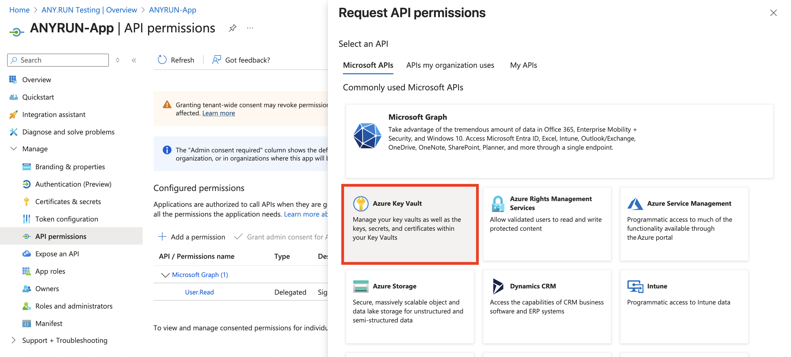
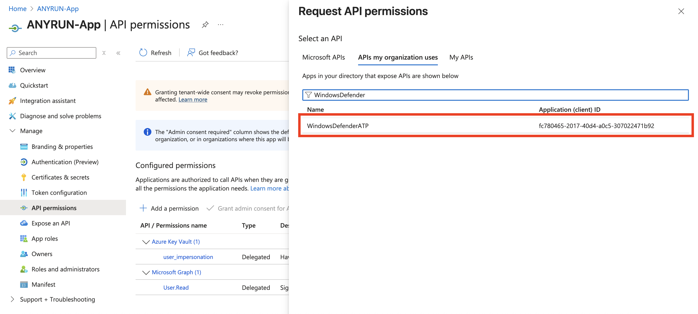
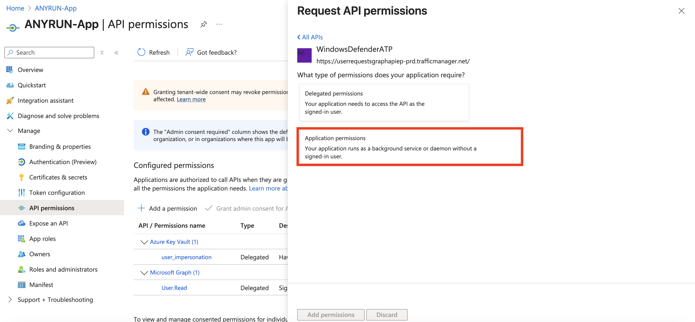
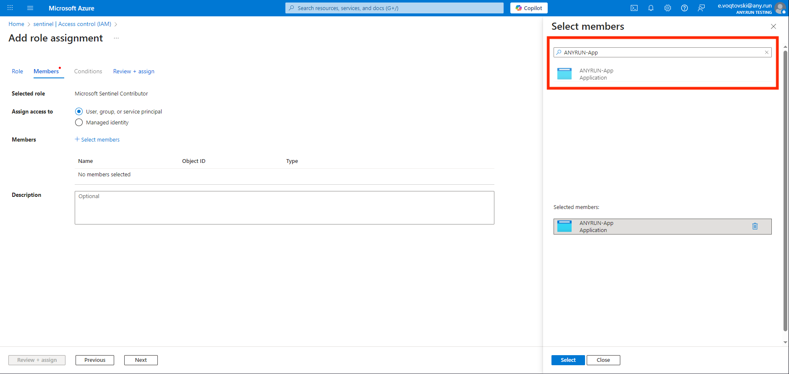
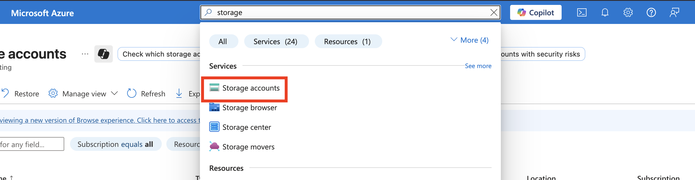
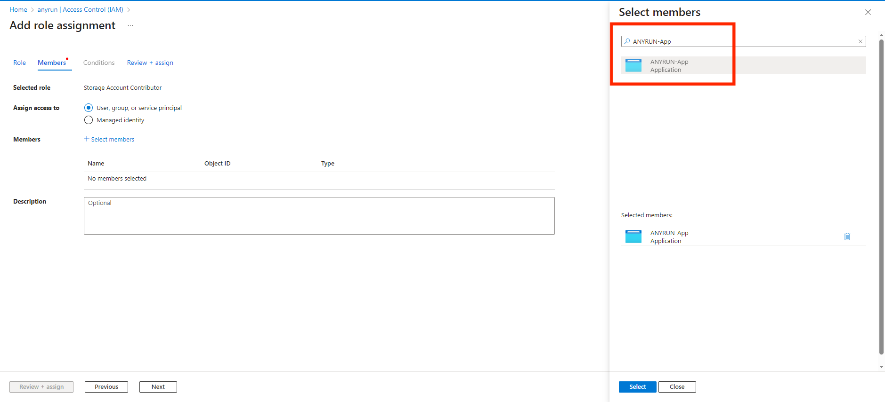
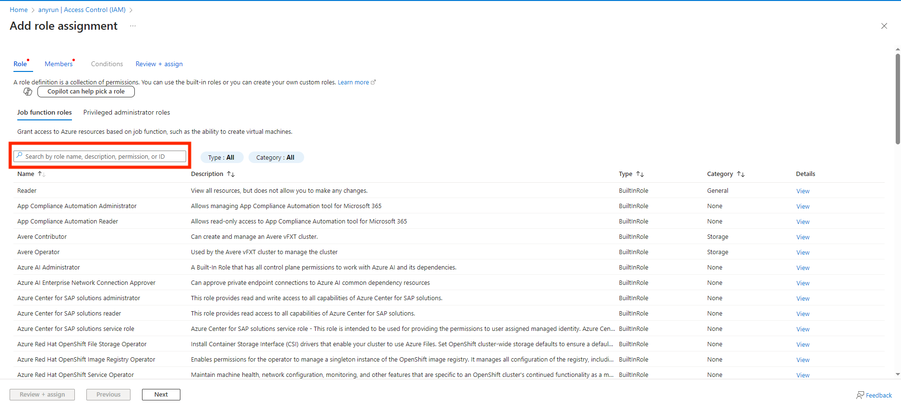
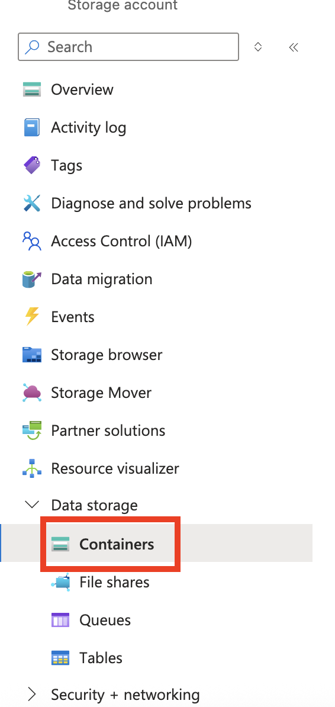
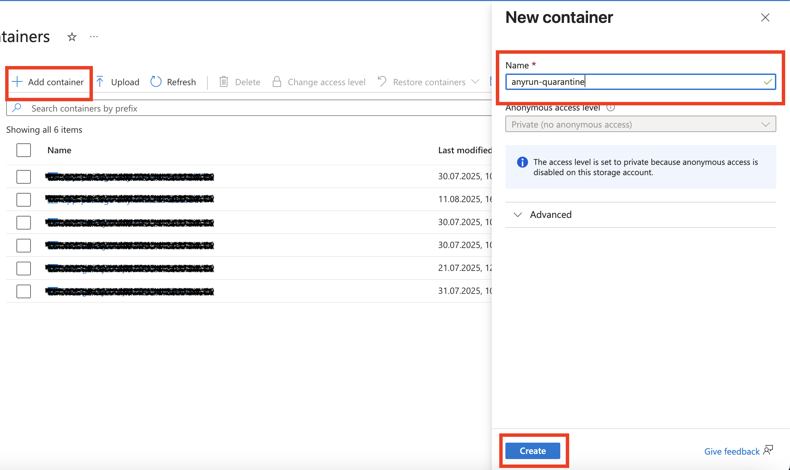

    

______________________________________________________________________

# Microsoft Sentinel Connectors for ANY.RUN Malware Sandbox

## Overview

This repository contains the necessary resources for integrating Microsoft Sentinel with the ANY.RUN Sandbox. The connectors enrich Microsoft Sentinel incidents by analyzing URLs or files associated with them in the ANY.RUN Sandbox.

As a result, your Microsoft Sentinel incidents will include a verdict, threat score, malware tags and a link to the detailed analysis in the ANY.RUN UI, allowing you to explore the object's behavior in a real infrastructure environment. Additionally, your Threat Intelligence portal in Sentinel will be enriched with Indicators of Compromise (IoCs) extracted during the sandbox analysis.

## Connector capabilities
- Incident enrichment:
  - Analysis Verdict and Threat score
  - Malware Tags
  - Table with IoC's detected during the analysis
  - Analysis Report Link
- Uploading IoC's detected during the analysis to Sentinel Threat Intelligence portal

## Analyze URLs from Microsoft Sentinel Incidents via ANY.RUN Sandbox

This playbook extracts URL from incidents and submit it for analysis in the ANY.RUN Sandbox to enrich the incident with a verdict using a single Azure Logic App.

[Open connector page](https://github.com/rollehfoh/ANY.RUN/tree/main/connectors/Microsoft/Microsoft%20Sentinel/ANYRUN-Sandbox-URL)

## Analyze Files from Microsoft Sentinel Incidents via ANY.RUN Sandbox

This playbook allows you to send files from incidents for analysis in the ANY.RUN Sandbox. It uploads the file from the endpoint to Azure Blob Storage and then forwards it to the ANY.RUN Sandbox using an Azure Logic App.

Templates are provided for endpoints running the following operating systems:
- Windows
- UNIX (Ubuntu, Debian)

[Open connector page](https://github.com/rollehfoh/ANY.RUN/tree/main/connectors/Microsoft/Microsoft%20Sentinel/ANYRUN-Sandbox-File)

## Analyze All Entities from Microsoft Sentinel Incidents via ANY.RUN Sandbox and Microsoft Defender for Endpoint

This template makes the incident enrichment process in Microsoft Sentinel even more automated if you are also using Microsoft Defender for Endpoint (MDE). In this case, the entire automation mechanism can be combined into a single Azure Logic App, leveraging MDE's capabilities to extract files from endpoints via API.

[Open connector page](https://github.com/rollehfoh/ANY.RUN/tree/main/connectors/Microsoft/Microsoft%20Sentinel/ANYRUN-Sandbox-Defender)

## Prerequisites

### Key Vault

- You need the Hunter pricing plan in ANY.RUN and your API key. We recommend storing your API key in Azure Key Vault. To do this, select your existing Key Vault or create a new one. Then, navigate to the **Objects** > **Secrets** section and create a new secret named `ANYRUN-APIKey`.

  > **Note:** It is recommended to keep this name unchanged, as otherwise, you will need to update it later in the deployed Logic App.

### App Registration

- You need to create a new application for your connector. To do this, go to **Microsoft Entra ID**.

- Click **Add** > **App registration**.

- Name your new application and click **Register**.

### API Permissions for new App

#### Key Vault API Permissions

- For the created application, add the following permissions for API connections in the **Manage** > **API permissions** > **Add a permission** tab:

- In the **Microsoft APIs** tab, add **Azure Key Vault**.

- Add the following permissions for it:

| Category | Permission Name   | Description                                                                 |
|----------|-------------------|-----------------------------------------------------------------------------|
| N/A      | user_impersonation | Allow the application full access to the Azure Key Vault service on behalf of the signed-in user |

#### Microsoft Defender ATP API Permissions

  > **Note:** This article is only required for workflows where you use Microsoft Defender for Endpoint (MDE) to extract files from the endpoint.

- Add an API connection for **WindowsDefenderATP**. Select the corresponding API in the **APIs my organization uses** tab.

- Then, select **Application permissions**.

- Select the following permissions:

| Category | Permission Name    | Description                                                                 |
|----------|--------------------|-----------------------------------------------------------------------------|
| Machine  | Machine.LiveResponse | Needed to gather evidences from machines                                  |
| Machine  | Machine.Read.All   | Needed to retrieve information about machines                               |
| Library  | Library.Manage     | Needed to upload custom ps1 script for retrieving AV related evidences      |

### Required Roles for the New App

Since the connectors use various resources available in Azure, the created application `ANYRUN-App` needs to be assigned the appropriate roles.

#### Key Vault

- Navigate to the required Key Vault where you previously added the ANY.RUN API-Key.

- Open **Access control (IAM)** > **Add** > **Add role assignment**.

- In the search window, type and select the role **Key Vault Secrets User**, then click **Next**.

- Description of the required role:

| Name                   | Description                                                                 |
|------------------------|-----------------------------------------------------------------------------|
| Key Vault Secrets User | Read secret contents. Only works for key vaults that use the 'Azure role-based access control' permission model. |

- Then, assign this role to the created application **ANYRUN-App**.

#### Sentinel

- Open your Sentinel workspace and navigate to **Settings** > **Workspace settings**.

- Open **Access control (IAM)** > **Add** > **Add role assignment**.

- In the search window, type and select the roles **Microsoft Sentinel Contributor** and **Log Analytics Contributor**, then click **Next**.

- Description of the required roles:

| Name                         | Description                                                                 |
|------------------------------|-----------------------------------------------------------------------------|
| Microsoft Sentinel Contributor | Microsoft Sentinel Contributor                                              |
| Log Analytics Contributor    | Log Analytics Contributor can read all monitoring data and edit monitoring settings. Editing monitoring settings includes adding the VM extension to VMs; reading storage account keys to be able to configure collection of logs from Azure Storage; adding solutions; and configuring Azure diagnostics on all Azure resources. |

- Then, assign these roles to the created application **ANYRUN-App**.

### Storage Account

  > **Note:** This article is only required for workflows where you use Azure Blob Storage to keeping file from the endpoint before submitting it to ANY.RUN Sandbox.

- Go to Azure Storage Accounts.

- Click **Create**.

- Type the name of Storage Account and click **Review + Create**.

- After that you should open your Storage Account and go to **Access Control (IAM)** > **Add**.

- Select your App `ANYRUN-App`.

- Find the following roles:

| Role                          | Description                                                                 |
|-------------------------------|-----------------------------------------------------------------------------|
| Storage Account Contributor   | Lets you manage storage accounts, including accessing storage account keys which provide full access to storage account data. |
| Storage Blob Data Contributor | Allows for read, write and delete access to Azure Storage blob containers and data. |

- Open your Storage Account. Go to **Data Storage** > **Containers**.

- Click **Add container**, type the **Name** for it and **Create**.

## Deployment

### Deploy Azure Function App

  > **Note:** This section is only required for workflows with file analysis (e.g. ANYRUN-Sandbox-File, ANYRUN-Sandbox-Defender).

- Click below to deploy Azure Function App with **Flex Consumption plan**
 

- Enter the parameters required for deploying the Function App and click **Review + create**.

- Description of the required parameters:

| Parameter Name               | Description                                                                 |
|------------------------------|-----------------------------------------------------------------------------|
| functionAppName              | Workflow name.                                                              |
| AzureStorageAccountName      | Azure Blob Storage Account Name.                                            |
| AzureStorageConnectionString | Azure Blob Storage Account Connection string.                               |

### Deploy Azure Logic Apps App

- After completing the preliminary settings above, you can proceed to deploy the Azure Logic Apps necessary for integrating Microsoft Sentinel and ANY.RUN Sandbox:
  - [ANYRUN-Sandbox-URL](https://github.com/rollehfoh/ANY.RUN/tree/main/connectors/Microsoft/Microsoft%20Sentinel/ANYRUN-Sandbox-URL)
  - [ANYRUN-Sandbox-File](https://github.com/rollehfoh/ANY.RUN/tree/main/connectors/Microsoft/Microsoft%20Sentinel/ANYRUN-Sandbox-File)
  - [ANYRUN-Sandbox-Defender](https://github.com/rollehfoh/ANY.RUN/tree/main/connectors/Microsoft/Microsoft%20Sentinel/ANYRUN-Sandbox-Defender)

## Request Support or Access to ANY.RUN’s Products

Feel free to reach out to us for help with integration, a quote, or a demo via the [contact us form](https://app.any.run/contact-us).
